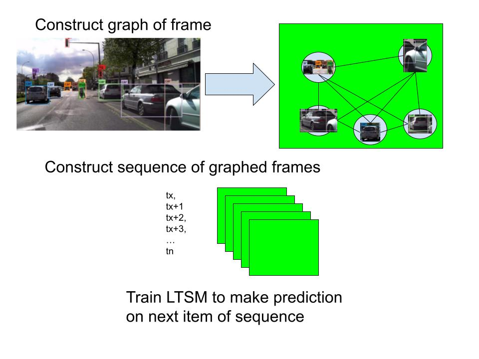
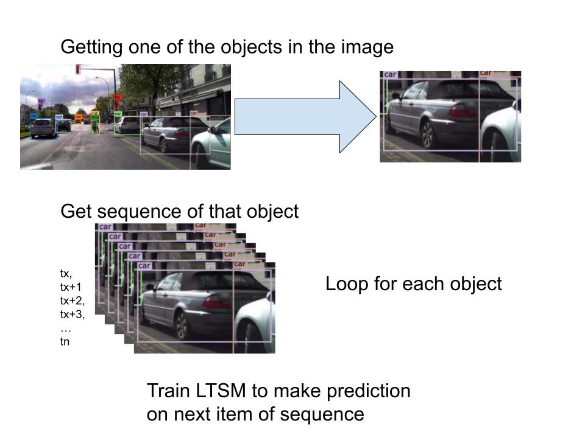

# GnnLtsm-trafficPrediction

<h4>Highschool research project on using GNNs to perform predictions on the positions of traffic
 </h4>

---

## Motivation

- Create a prototype that gives credence to the idea of using GNNs to perform scene prediction in a driving scenerio
- Help new learners to learn AI in Pytorch.
- Learn AI. 

---

## Dataset

[Dataset](https://www.kaggle.com/datasets/robikscube/driving-video-with-object-tracking) of 1000 video files of vechicle driving footage and multi-object tracking labels. Includes:

- Unique ID's for each object
- Classification for type of object. Bus, Car, Pedestrian, Motorbike
- Position of box coordinates relative to camera

---

## Outline

- Create an LTSM that accepts a sequence of node graphs of a frame of a scene to make predictions on the next frame. 
  - 
  - These graphs can be constructed using a Graph Neural Network

- Create another solo LTSM that accepts a sequence of one object to predict where it will be next frame
  - 

- Compare the accuracy of both

---

## Results

- The GNN-based and LTSM based programs are implimented in Pytorch
- Compare the accuracy of GNN and LTSM
- GNN still requires more work
- Structure of GNN program
  - Graph each frame of a video as a node graph
     - Ground truth will have positions of box cordinates encoded into nodes and the distance between each object as a relationship
  - Train a GNN to perform predictions on what each relationship would look like
    - Given a node graph, it should guess what the relationship will be
  - Give an LTSM sets of these graphs of tx - ty-1 to predict the box cordinates of each node in ty

---

## Possible Improvements

- Lack of datasets on relationships between objects in a driving scenerio
  - Ideally would use a dataset that had more information on what a car is doing and their relationship to another car. For example:
    - Yielding to another car/pedestrian
    - Stopping for another car
    - Going forward
- The structure used does not fully utilize the power of GNNs
  - More relationship data would improve the results of using a GNN as mentioned before
  - Relies on the LTSM to make the final prediction
    - The LTSM is taking node graphs generated by a GNN and making predictions off of that
    - A better way of performing predictions is for the GNN to make predictions directly
 
---
## Document

The notebook is divided into the following sections

- Import libraries
  - numpy, panda, torch, torchvision, sklearn, matplotlib, Image, etc
- Utility functions for saving and loading models
- Show the project folder structure
  - Pytorch provides a default folder structure for easy loading training and testing images

## Contact

ericxu1728@gmail.com
